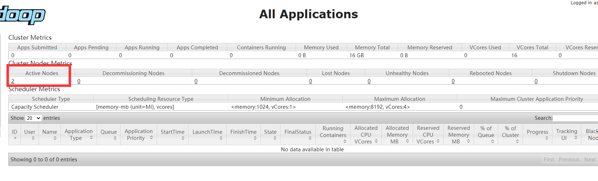

## HADOOP+HBASE+HIVE+SPARK在windows和linux一键部署

**Github请前往Realse进行下载**

**或者下载地址**

QQ群 625598191 请前往群内下载


##### **[原博客链接地址]**

### http://lxc.life:23456/wordpress/?p=628


**[安装指南]**

**先在windows下解压然后运行14config/new-key.bat**


### 请记住：Windows用到的是bat,Linux是sh

**windwos请尽量使用管理员权限运行文件**

环境分为windows和linux

需要先安装mysqlserver

**ubuntu**

sudo apt install -y openssh-server mysql-server

**centos**

sudo yum install -y mysql-server

**windows**

mysql官网下载


**下载完后非root用户登录的Linux统一步骤**

cd /home

sudo mkdir node

sudo chown -R $USER node


**windows或root登录linux**

啥都不用干


~~**Winodws负责控制的主机需要将其主机ssh秘钥替换为14config/id_rsa**~~

~~**或者linux直接使用我打包好的 直接执行002-dogeodell-Master.sh**~~


~~**或者使用压缩包原带、ssh-keygen来生成新的秘钥**~~


**打开压缩包修改如下内容**

~~14config\hadoop\core-site.xml将THIS地址改为自己主机的地址~~

~~14config\hadoop\yarn-site.xml将THIS地址改为自己主机的地址~~

~~将14config中的id_rsa.pub替换成自己的公钥~~

09patcher\hive\lib需要你替换成自己MySQL需要的Connector(例如笔者的mysql是8的版本则需要版本8的connector) **（其实基本不需要）**

14config\hive\hive-size需要替换成你自己的数据库配置

14config\hosts改成自己成员的主机代号

其中将控制的ip设置为master

14config\hadoop\workers将改为自己组员的主机代号


### **举个例子**

**两个样本分别为**

张三(zs)IP为192.168.31.25

李四(ls)IP为192.168.31.218

王五(ww)IP为192.168.31.72

张三是负责控制的节点也是namenode

**则hosts文件应该修改为如下**

```
192.168.31.254 master
192.168.31.218 vm2
192.168.31.72 vm1

# 下面的不要修改
127.0.0.1 localhost
0.0.0.0 THIS
::1     ip6-localhost ip6-loopback
fe00::0 ip6-localnet
ff00::0 ip6-mcastprefix
ff02::1 ip6-allnodes
ff02::2 ip6-allrouters
```

**14config/hadoop/Slave文件应修改为如下**

```
vm1
vm2
master
```

**然后把修改后的压缩包上传到/home/node路径之下**

随后在/home/node路径执行tar -xvf DogeOdellAmazingWork.tar解压到当前路径

然后执行

cd DogeOdellAmazingWork.tar

chmod +x *.sh


#### **1.每个人要都去执行**

001-dogeodell-install.sh/bat


#### **2.每个人执行后**

**linux**

sudo su node

或ssh登录到node用户

ssh node@zs


**windows**

点击打开001-dogeodell-shell.bat

然后输入运行start-all


#### **3.负责控制的张三应该额外执行**

**如果是linux**

sudo su node

或ssh登录到node用户

ssh node@zs

**然后切换到我们的安装路径**

./002-dogeodell-Master.sh

./001-dogeodell-addfile.sh


**如果是Winodws**

请直接点击运行

001-dogeodell-addfile/002-dogeodell-Master

不需要切换用户


**至此安装结束**

windows 可以使用任意用户单机打开001-dogeodell-shell.bat然后运行脚本

linux登录node用户即可运行所有脚本


#### **最后执行我们的脚本大全**

修改配置可以重复执行dogeodell-config.sh/bat


#### **如何判断成功？**

登录http://master:8088

查看节点数量与组员数量一致



然后前往master主机执行最终脚本大全即可
